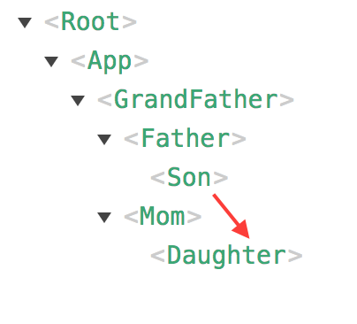

# Vue.js

## Components

### Basic
(08.Component.html)
```html
<html>

<head>
    <script src="https://unpkg.com/vue"></script>
</head>

<body>
    <div id="example">
        <my-component></my-component>
        <my-component2></my-component2>
        <my-component3></my-component3>
    </div>
    <template id="mytemplate">
        <div>ttt
            <div>
    </template>
</body>
<script>
    Vue.component('my-component', {
        template: '<div>A custom component!</div>'
    });

    Vue.component('my-component2', {
        template: '<span>{{ message }}</span>',
        data: function () {
            return { message: "my message" }
        }
    })

    Vue.component('my-component3', {
        template: '#mytemplate'
    })

    // create a root instance
    new Vue({
        el: '#example'
    })

</script>
<html>
```

### Composing Components


#### Prop

```html
<html>

<head>
    <script src="https://unpkg.com/vue"></script>
</head>

<body>
    <div id="example">
        <child message="hello child"></child>
        <br>
        dynamic
        <input v-model="parentMsg">
        <br>
        <child2 v-bind:my-message="parentMsg"></child2>
    </div>


</body>
<script>
    Vue.component('child', {
        // declare the props
        props: ['message'],
        // just like data, the prop can be used inside templates
        // and is also made available in the vm as this.message
        template: '<span>{{ message }}</span>'
    })

    Vue.component('child2', {
        // declare the props
        props: ['myMessage'],
        // just like data, the prop can be used inside templates
        // and is also made available in the vm as this.message
        template: '<span>{{ myMessage }}</span>'
    })    

    // create a root instance
    new Vue({
        el: '#example',
        data :{
            parentMsg : "hi"
        }
    })

</script>
<html>
```

#### emit events
```html
<html>

<head>
    <script src="https://unpkg.com/vue"></script>
</head>

<body>
    <div id="counter-event-example">
        <p>{{ total }}</p>
        <button-counter v-on:increment="incrementTotal"></button-counter>
        <button-counter v-on:increment="incrementTotal"></button-counter>
    </div>
</body>
<script>
    Vue.component('button-counter', {
        template: '<button v-on:click="increment">{{ counter }}</button>',
        data: function () {
            return {
                counter: 0
            }
        },
        methods: {
            increment: function () {
                this.counter += 1
                this.$emit('increment')
            }
        },
    })
    new Vue({
        el: '#counter-event-example',
        data: {
            total: 0
        },
        methods: {
            incrementTotal: function () {
                this.total += 1
            }
        }
    })

</script>
<html>
```

### With Vue File

- complicate data binding



Son -> Father -> GrandFather -> Mom -> Daughter

- vuex

